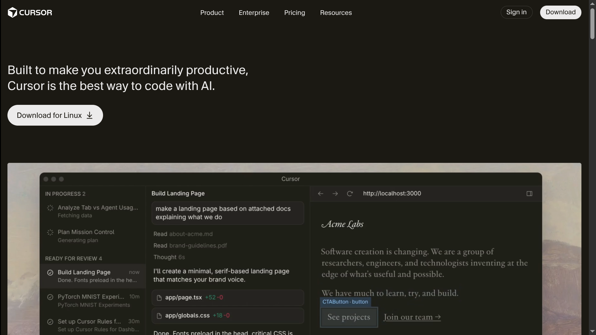
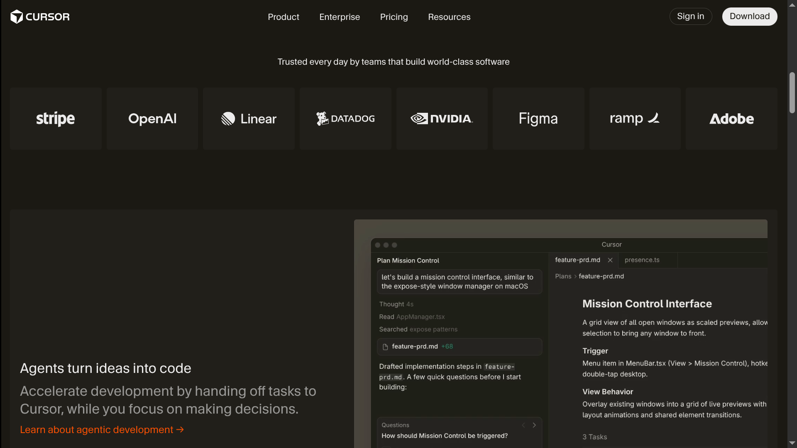
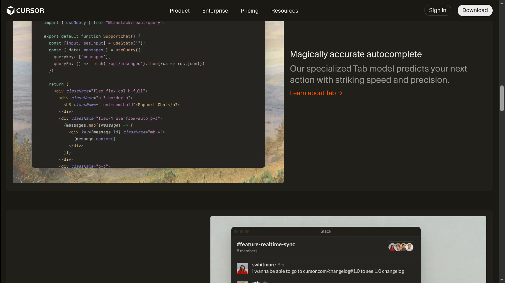
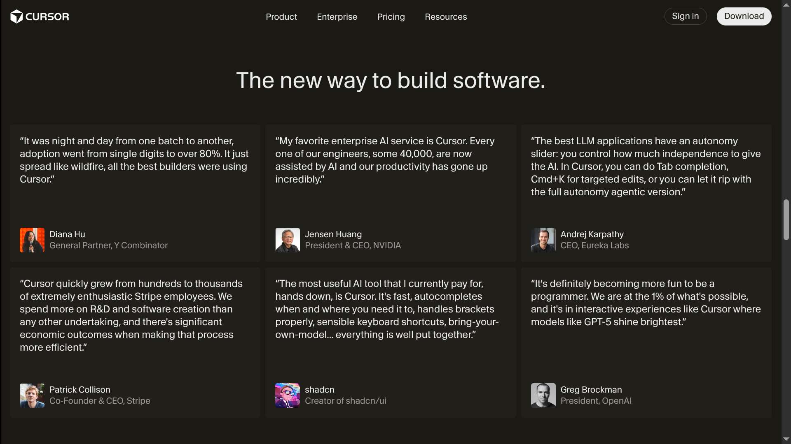
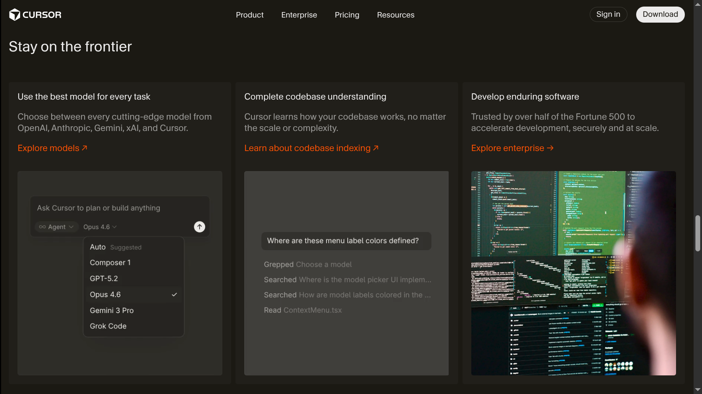
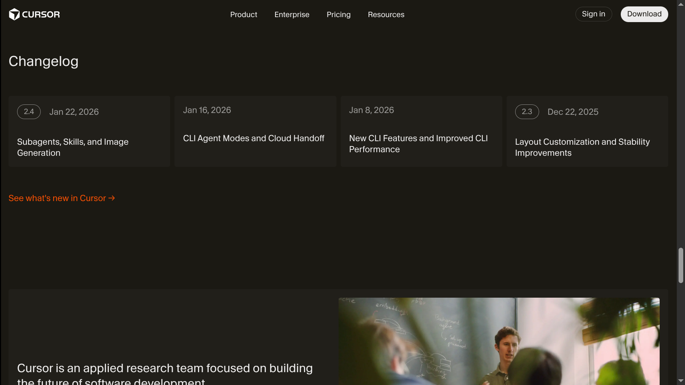

# Cursor Landing Page Clone

## Project Overview

This repository contains a high-fidelity recreation of the [Cursor](https://cursor.com) landing page, focusing on structural accuracy and visual hierarchy. It was developed as an assignment for the ChaiCode Web Development Cohort 2026.

This project is part of my [ChaiCode Web Dev Cohort 2026 Archive](https://github.com/sameerbhagtani/web-dev-cohort-2026). Checkout my entire journey there!

## Accessing the Project

Check out the live version of this website at: https://sameerbhagtani.github.io/cursor-landing-page-cohort/

To clone the repository locally, execute the following command:

```bash
git clone [https://github.com/sameerbhagtani/cursor-clone-cohort](https://github.com/sameerbhagtani/cursor-landing-page-cohort)
```

## Technical Features

- **Visual Fidelity:** Meticulous recreation of Cursor’s layout, typography, and color palette for maximum accuracy.
- **Full Responsiveness:** Extended the desktop-first requirement with custom media queries for all screen sizes.
- **Modern CSS:** Utilized advanced spacing and alignment techniques to mirror the professional dev-tool aesthetic.
- **Semantic HTML5:** Structured with meaningful elements including `<nav>`, `<header>`, `<main>`, `<section>`, `<article>`, `<time>`, and `<footer>`.
- **Asset Optimization:** Integrated brand-specific assets and SVGs for crisp, high-performance rendering.

## Screenshots







